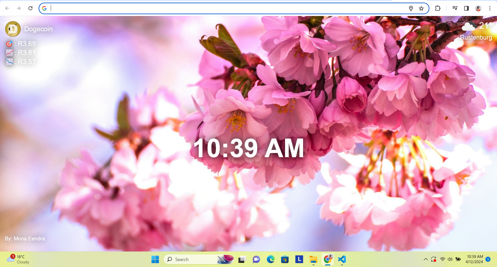

# [JSL09] Personal Dashboard Chrome Extension

Scrimba Reference Link: https://scrimba.com/learn/frontend/promise-rejection-coc4a4e4d8d208ab33b190dd5

## Overview
In this project I created a personal dashboard chrome extension by utilizing various APIs to provide users with real-time information. This creates an informative and engaging user experience with content that is constantly updated.

## Project Features

- **Background Image & Author's name:** Fetching a random flowers image from the Unsplash API as the background and displaying it, along with the author's name at the bottom left corner.
- **Crypocurrency Data:** Retrieves data about Dogecoin from the CoinGecko API and presents it on the webpage.
- **Time:** Continuously updating time by the second and displays the current time in a 12-hour format.
- **Weather Conditions:** Fetches weather data based on the user's geolocation from the OpenWeatherMap API, showing the weather conditions in the user's area. 

